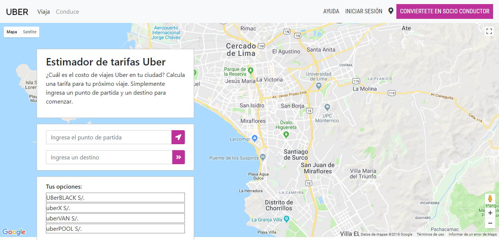

# FARE ESTIMATE
Fare Estimate es una web dinámica que nos muestra la tarifa de uber de acuerdo a la distancia desde el punto de origen hasta el destino.

## Desarrollado para [Laboratoria](http://laboratoria.la) 

### HERRAMIENTAS:  
Las tecnologías que se usaron para crear nuestra web son:
- HTML 5
- CSS 3
- JQuery
- Javascript
- Bootstrap
- google maps
### CONTENIDO:  
- contiene un mapa que mediante un input pide al usuario su origen y el destino al que se dirije, despúes de obtener estos datos se traza la ruta y se muestra el tarifario de acuerdo con la distancia a recorrer.

Desarrolladoras: 
- Elizabeth Segura
- Daniela Gonzales